# V2 - Inexpensive DIY Wi-Fi & BT speaker for Home Assistant audio; $50 using off-the-shelf parts. 

### Version 2. Inexpensive off-the-shelf passive speaker with added ESP32 controller and open source firmware for whole-home synchronized audio and TTS notifications with Home Assistant.

*Completed modification of a compact bookshelf speaker for wireless whole home audio using Home Assistant.*

---

## Table of Contents

- [What This Is](#what-this-is)
- [Motivation](#motivation)
- [Option to Purchase - Already Assembled](#option-to-purchase---already-assembled)
- [Caveats & Limitations](#caveats--limitations)
- [Parts & Materials](#parts--materials)
- [Tools Required](#tools-required)
- [Build Time](#build-time)
- [Step-by-Step Build Guide](#step-by-step-build-guide)
- [What's Next](#whats-next)
- [Credits & References](#credits--references)

---

## What This Is 

- A documented process to easily create your own inexpensive, commercially available passive loudspeaker into a Wi-Fi active speaker for use with Home Assistant.
- A DIY guide to adding an inexpensive, off-the-shelf ESP32-based controller with integrated DAC, DSP and AMP inside an existing speaker cabinet and flash with open source firmware (Squeezelite, SendSpin, ESPHome).
- A viable alternative to using Sonos for whole-home, multi-room synchronized audio, streaming music and home automation notifications using Music Assistant.
- Part of a planned series modifying a range of speakers at multiple price points and corresponding sound quality.
  — see [What's Next](#whats-next) for planned future builds.
- An [option to purchase](#option-to-purchase---already-assembled) pre-assembled for those wanting a commercially available speaker. 

**This is NOT:**

- A project that requires wood working skills to build a speaker cabinet from scratch.  At most, you may need to drill a single hole into a wood cabinet - or have someone 3D print a small plate for you.

- A smart speaker. Stay tuned for a future build this year. We will likely use this same speaker and the modifications to add smart speaker capabilities compatible with Home Assistant Voice Preview could be minimal.

  

---

## Motivation

There are no commercially available speakers specifically for use in the Home Assistant platform. Sure, you can find WiFi and BT speakers that can be integrated into HA, but they are either expensive, proprietary, complicated to integrate, etc., etc.

We want to change that.

Our first project, really more of a proof-of-concept, started with a high end speaker kit. It was expensive.

It sounded great!  But nobody was particularly excited to shell out over $250 to build their own speaker. 

We get it.  We hear you.  Something...cheaper, faster to build.

Our version 2 started with the lowest cost, passive speaker we could find available at Amazon, Walmart, etc.  $35 for a pair.

This is a single-driver, compact - and very decent sounding - speaker for desktop music and TTS notifications. It's even ideal for larger rooms if you're primary goal is a low cost speaker for just notifications.  Quick and easy to integrate with firmware designed specifically for use with Home Assistant. No lock-ins, proprietary interfaces or custom integrations that may, or may not be around in 2-3 years.

---

## Option to Purchase - Already Assembled

My motivation is not completely altruistic.

I'm hoping to start a company.  During my research, I found commenters on DIY forums asking for assembled options - some even offering to pay OPs to "build me one please,"

So this is my boot strap option with a commitment to remain open source.  I am specifically creating speakers for use exclusively with Home Assistant and based on existing off-the-shelf speaker models that can be easily modified by the DIYer.  For those individuals who would prefer to purchase a speaker fully assembled and tested, well...that's the market I'd like to help with...I want to be the RATGDO of the Sonos market space.

My commercial site will be [GetHouseWaves.com]() with contact forms and details to order direct.

And at least initially, I will be selling through Etsy and will add links here when they are ready. 

---

## Caveats & Limitations

- You will power using an ESP32 board called "LOUD" by Sonocotta. The volume is more than sufficient for this speaker, but the power is limited. Using an upgraded board (e.g. their "LOUDER" model) could likely damage this speaker at high volumes.

- Speakers benefit from "run-in" time to loosen the driver suspension and improves audio quality over time. We recommend playing at lower (under 70%) volume settings for at least 100 hours before testing its limits.

  

---

## Parts & Materials

---

Prices shown are approximate USD and do not include shipping, taxes or customs fees.

Speakers are sold in pairs, but other parts are sold individually. Adjust if you plan to build both.

Links are for the actual product I purchased.

| #    | Component                                                    | Qty        | Price | Notes                                                        |
| ---- | ------------------------------------------------------------ | ---------- | ----- | ------------------------------------------------------------ |
| 1    | [Saiyin Passive Bookshelf Speakers](https://www.amazon.com/dp/B0DGLMY9SB) | 2 cabinets | $36   |                                                              |
| 2    | [Sonocotta LOUD ESP32](https://www.elecrow.com/loud-esp32.html) | 1          | $20   | ESP32 with integrated DAC & AMP;  no Ethernet module;  optional $5 RPi case to protect the circuit board **buy two if modifying both speakers.** |
| 3    | [USB-C Panel Mount Cable](https://www.amazon.com/dp/B09HWSFRP1) | 1          | $10   | **buy two if modifying both speakers.**                      |
| 4    | Optional back plate                                          | 1          | $1    | If you have access to a 3D printer, print the 1.5" square plate (STL file included).  Otherwise, you can drill a small hole for the cable.  **print two if modifying both speakers.** |

------

## Tools Required

- Phillips screwdrivers (regular size for panel screws and small size for circuit board)
- Wire cutter/stripper
- Pliers (tighten the cable retaining nut)
- Electric drill and 5/8" drill bit -- OR -- access to 3D printer
- Computer and USB-C cable (firmware install)

---

## Build Time

- Less than 1 hour per speaker.

---

## Step-by-Step Build Guide

### Step 1 — Remove the existing plates on the back

1. Each speaker has a bracket (for hanging on the wall) and a speaker wire connector plate with spring clips. It's easier to remove both for the assembly process and replace the hanging bracket when finished or seal the two screw holes with a black glue.

2. KEEP all the screws, you will likely need them again depending upon the options you choose.

3. Pull open the wire connector plate and cut the speaker wires as close to the connector tabs as possible.  The capacitor is used as both a high-pass filter and a DC-voltage protection device for the speaker driver.  Given the low voltage and power supplied by the ESP32 amplifier, you can safely throw away the capacitor along with the little panel it is glued too.  Music Assistant provides an equalizer function for active frequency filtering making the high-pass filter function redundant.  That said, you are welcome to carefully pry the capacitor away from the old plate and wire (in serial) with the driver when connecting to the ESP32 speaker terminals.

   

   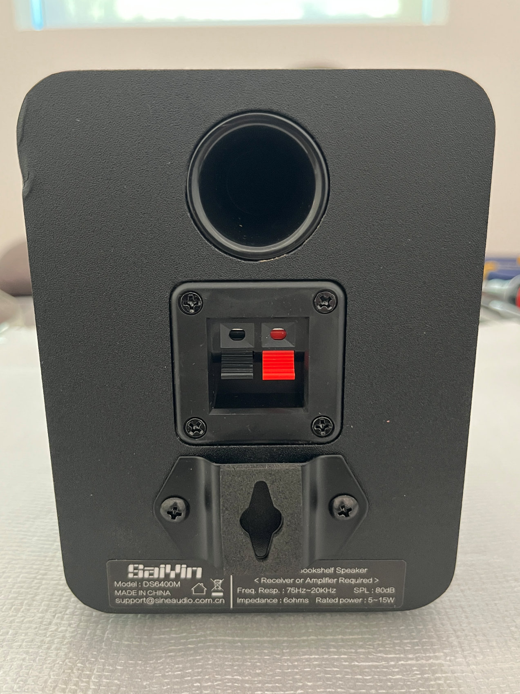
   *Closeup of the Saiyin speaker back.  Note the bracket, wire connector panel - and the damaged cabinet I rec'd.*

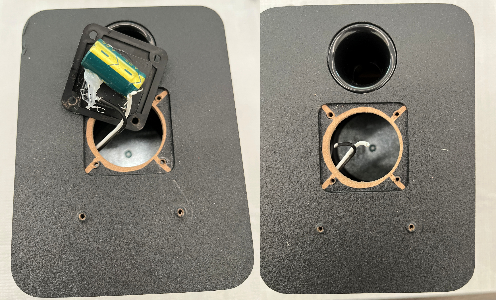
*Closeup of the Saiyin speaker back with the wire connector plate removed, and with the speaker wires subsequently cut.*

---

### Step 2 — Remove the driver from the front

1. Loosen screws and gently remove the front speaker driver.  You will need this large hole open to insert the ESP32 board inside the speaker cabinet. 

   

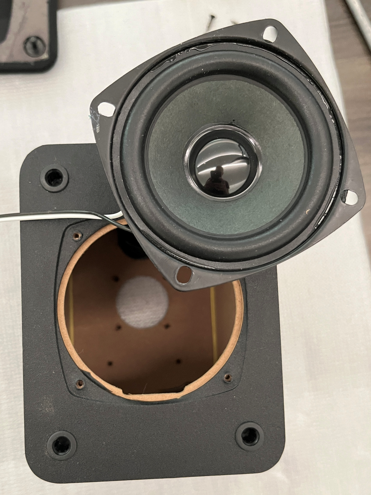
*Closeup of speaker cabinet with all the attachments removed, including the driver.*

---

### Step 3 — Attach driver wire to the ESP32 board

1. OPTIONAL - if you are using an RPi case for protection, attach the LOUD ESP32 board to the base (as shown in the photo below).  I declined to use the top of the case in my speaker.  

2. Gently strip approx 1/4" on the ends of the white and black driver wires.

3. Attach the wires to the speaker terminals of the LOUD ESP32 board, paying attention to the driver polarity. The white wire was "+" and should be connected to the outermost terminal on the board.  One side of the board is for LEFT speaker, the other side of the board is for RIGHT speaker. Your choice on which side you choose. OPTIONAL - if you choose to reuse the capacitor, you will need to wire it, in series, using the same polarity as before - attached to Capacitor's NEGATIVE terminal to the Driver's POSTIVE WHITE wire, the Capacitor's POSITIVE terminal will be wired to the ESP32's POSITIVE speaker terminal.

   

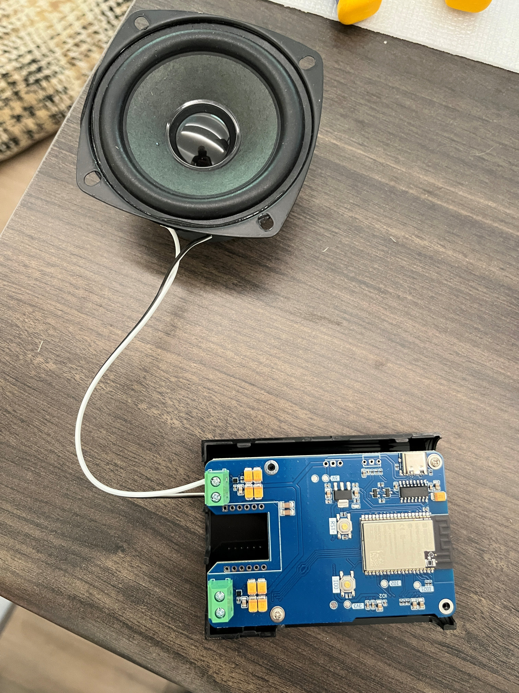
*Speaker driver wires connected to the LOUD ESP32 circuit board,* without reusing the capacitor.

---

### Step 4 — Install USB-C cable connector

1. TWO OPTIONS:

   a) If you have access to a 3D printer, you can print the 42mm square plate with a hole that fits the USB-C cable as shown in the photo shown below. This plate is the same size and shape as the speaker connector plate you removed. An STL file has been provided for this part. It's small, requires very little filament and takes only minutes to print.

   Insert the threaded USB-C connector inside the hole of the plate, securing in place with the plastic nut, then attach the plate to the back of the speaker with the same screws that had held the connector plate in place.

   b) OR, you can drill a 5/8" hole in the back of the cabinet. I did not attempt this, but would suggest placing this hole in one of the upper corners, near the plastic port. The reason is to keep the bottom section open for the ESP32 board, and to provide enough space inside the cabinet for the USB-C cable to loop downwards.

   Insert the threaded USB-C connector into the speaker cabinet, through the drilled hole, securing in place with the plastic nut on the back of the speaker cabinet.

   

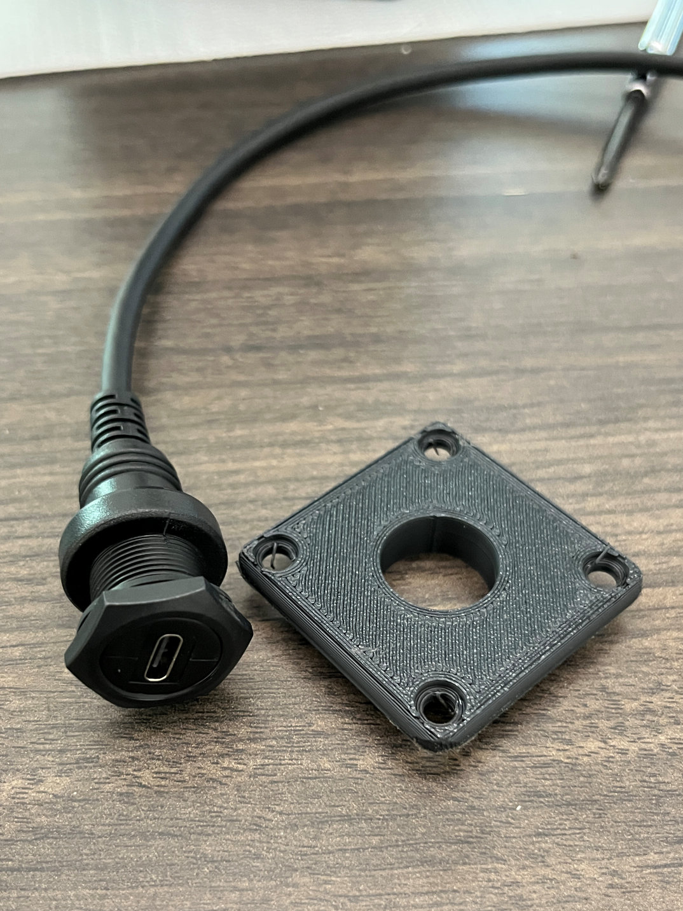
*Closeup of the USB-C connector cable and the 3D printed plate that replaces the original speaker wire plate.*

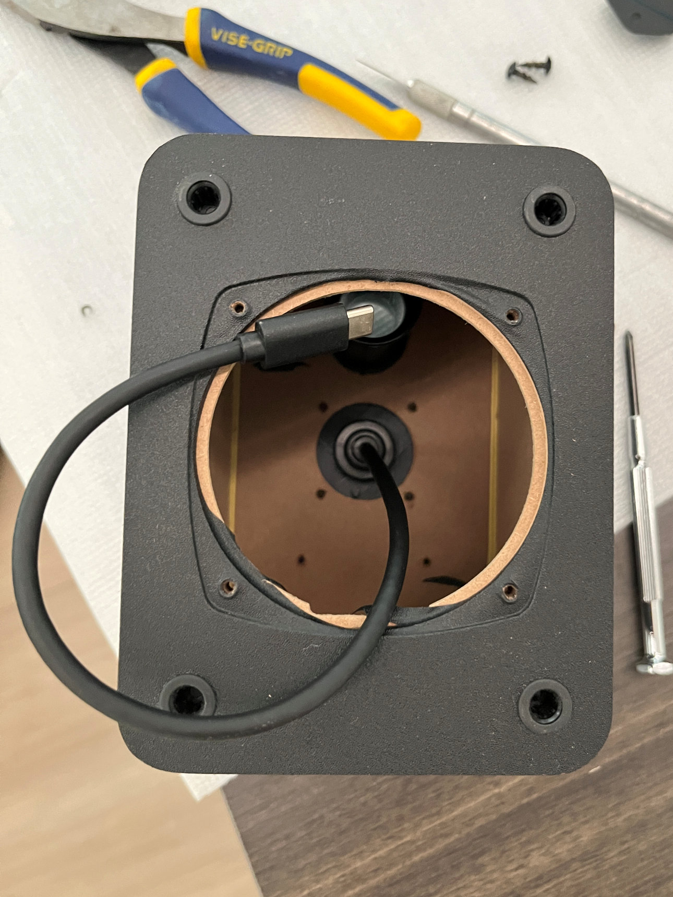
*USB-C connector cable inside the cabinet, after attaching the 3D printed plate with the screws used for the original plate.*

---

### Step 5 — Flash the ESP32 controller with Squeezelite firmware

This project uses **Squeezelite-ESP32** firmware for seamless Home Assistant integration via Music Assistant. Squeezelite is an open source audio player that streams directly to Music Assistant without requiring ESPHome or YAML configuration.

NOTE - Sonocotta controllers are also compatible with SendSpin (Yay!!), ESPHome and SnapCast.  You may use any of them. There are matrices that discuss the pros and cons of each option. [This is a good starting point to review.](https://sonocotta.com/loud-esp32/) 

We are excited to soon be using SendSpin in the near future as this is Home Assistant's promising new protocol for exceptional multi-room music synchronization. We just haven't had time to fully test it yet, so for now we are providing instructions to use Squeezelite.

Also note - you are able to flash and reflash the ESP32 board with any of the available firmware options at any time!

1. Connect a USB-C cable to the ESP32 board and your pc or laptop 

2. Open the web-based firmware installer: https://sonocotta.github.io/esp32-audio-dock/

3. Scroll to the section for **Loud-ESP32 Boards**, click on the box labeled **16-bit (Standard Quality)**
     (note the readme link at the top of the page, for why to use 16-bit vs 32-bit)

   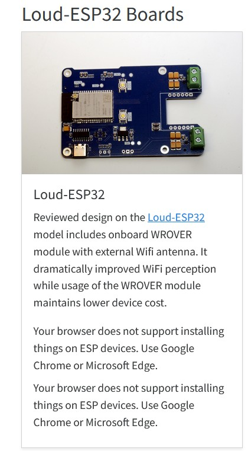

4. Select option to **Install Loud-ESP32-16Bit** follow the prompt to **Install** and wait 2-3 minutes as it proceeds

   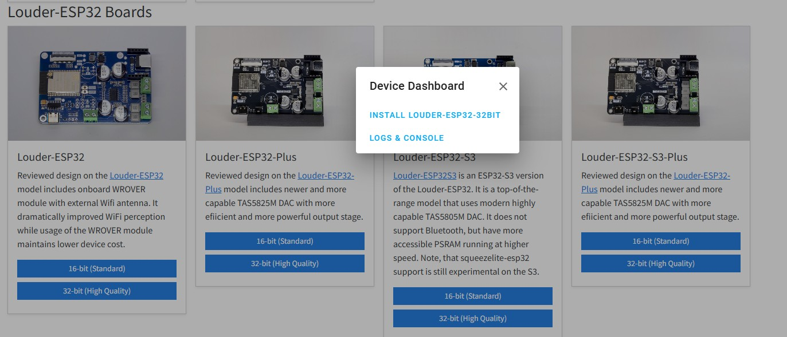

5. After firmware installs, return to the menu above, 

   a. select **Logs & Console**

   b. select **download the log** to your laptop (handy - but not necessary - to have for review later)

   c. keep the log open for next step - you can see what IP address it acquires which you will need later

6. Using a mobile device (phone, tablet, etc.), 

   a. connect your mobile device to the board's WiFi SSID: louder-esp32

   b. open a browser and enter: https://192.168.4.1 

   c. using the Louder-ESP32 GUI menu, select your home WiFi, enter the WiFi password, select **Join**

   d. click Save, connect your mobile device back to your home WiFi SSID

   e. open a browser and enter the IP address assigned in the log (look for 3 green lines like below)

   f. click on the **Exit Recovery** button near the bottom of the page. (**this is important to "Exit Recovery" instead of reboot.**  Recovery mode is - for lack of a better analogy - *similar to booting in safe mode,* allowing you to restart and configure options for connecting to you home wifi, etc. when you want to start over. You want to exit this mode before using the device in Home Assistant)

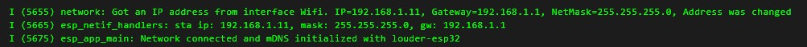

---

### Step 7 — Test Before Closing Up

1. Plug the ESP32 board into the USB-C connector inside the speaker cabinet (but keep the board outside to test)

2. Plug your USB-C power/data cable into the rear of the speaker.

3.  Use your mobile device to test connecting to the louder-esp32 device via Bluetooth as a quick audio check

4. Then test with Home Assistant / Music Assistant

   a. Go to Player Settings

   b. Confirm the loud-esp32 Squeezelite player appears

   c. Add as a new player

   d. Stream a song or play a TTS notification to confirm audio output

   e. Test by changing volume, pausing, and resuming to verify full media player control

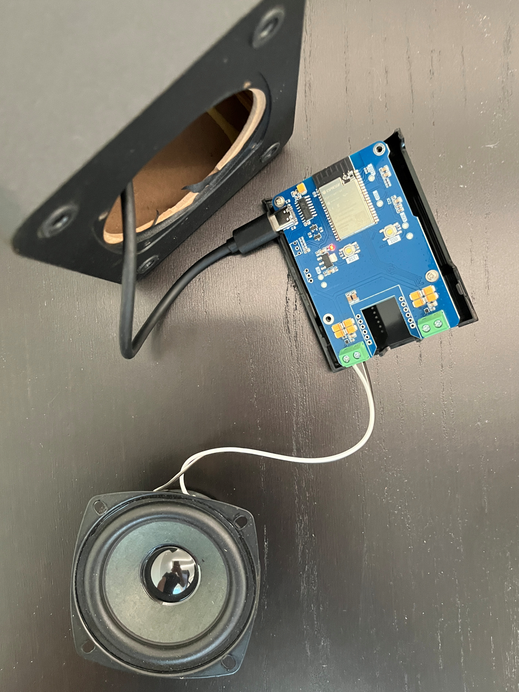
*USB-C connector cable connected to ESP32 for testing with Home Assistant, BEFORE final assembly.*

---

### Step 8 — Final Assembly

1. You will need to disconnect the USB-C cable from the ESP32 board to slide it inside the cabinet.

2. Carefully slide the ESP32 board inside the front driver hole, with the green speaker terminals going in first.

3. Tilt the board up as you slide it inside, allowing you to rotate the board sideways (see photo below), before reattaching the USB-C plug into the ESP32 board.

4. NOTE - it's a tight fit, so the driver wire need to be bent upwards. The USB-C cable will need to curl around and below the driver wall.  The added tension will help hold the ESP32 board in place against the back wall.

5. Fasten the driver to the front using the existing screws and replace the front grill.

   

   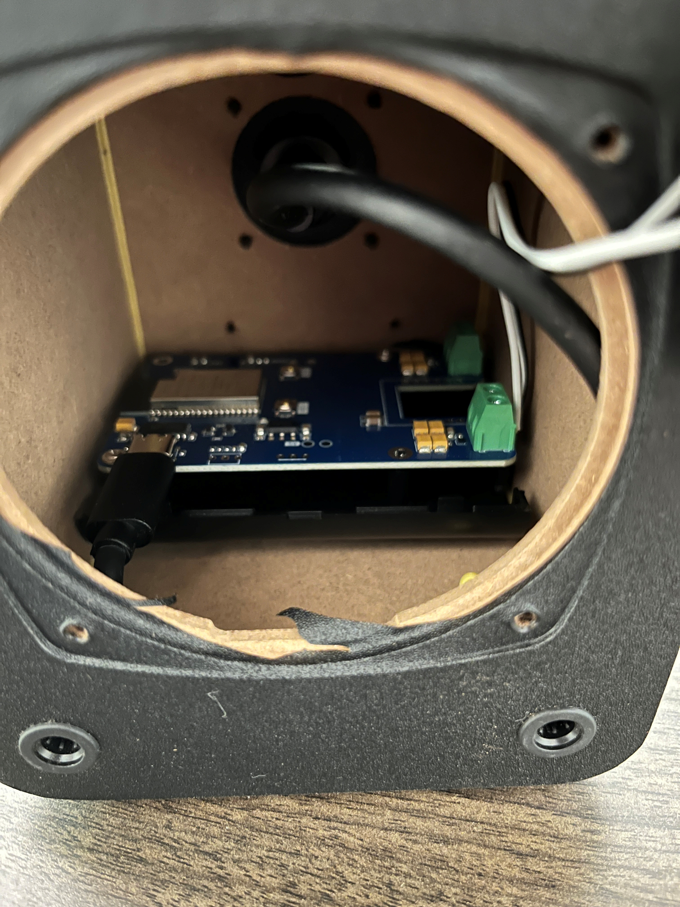
   *ESP32 board (and RPi case bottom) inside the cabinet, with driver wires and USB-C cable in place.*

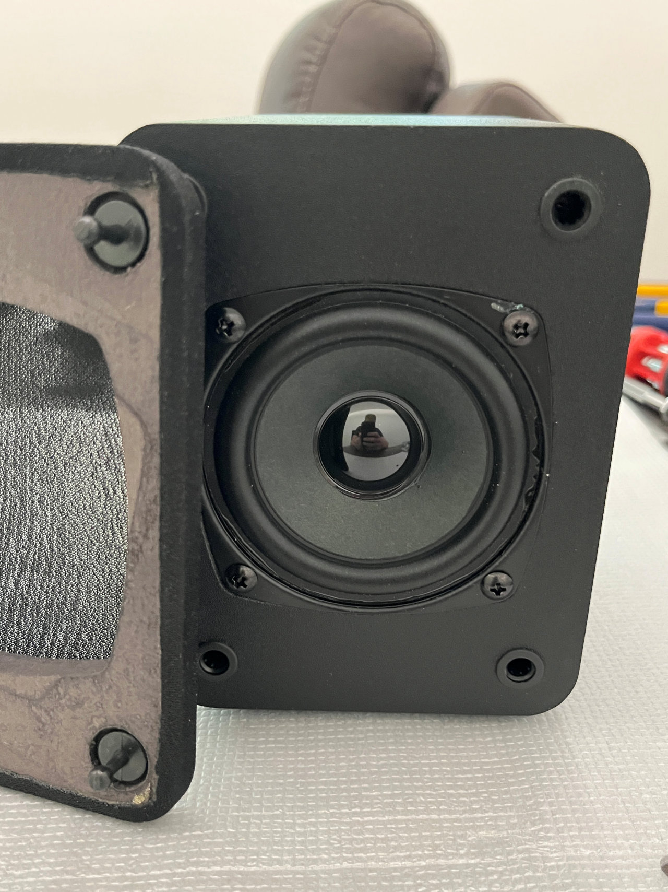
*Driver reattached to the front using screws and ready for snapping on the front grille.*

---

## What's Next

This is **Build #1** in a planned series of passive-to-active speaker conversions — a DIY Sonos alternative using ESP32 and Music Assistant across multiple rooms.

| Build | Speaker                                                      | Status           |
| ----- | ------------------------------------------------------------ | ---------------- |
| #1    | Tozzi One + Sonocotta Louder ESP32                           | ✅ Complete       |
| #2    | HouseWaves-One; Low-end, low-cost (sub $50) single driver speaker | ✅ Complete       |
| #3    | Mid-range, mid-cost (sub$100), 2-way speaker                 | 🔜 April 2026     |
| #4    | SendSpin firmware testing - for use with HW-One and HW-Two speakers | 🔜 April/May 2026 |
| #5    | Smart speaker option                                         | 🔜 May/June 2026  |
| #6    | High-end speaker, true Sonos-sound quality and competitive option for Home Assistant | 🔜 July 2026      |

**Features planned for future builds:**

- Open-Source, Smart-speaker option, fully compatible with Home Assistant Voice Preview (HouseWaves-SmartVP)
- Additional power options - e.g. Power over Ethernet (PoE)
- Option to pair a second passive speaker with 1 wire (HouseWaves-DUO).
- DAC & Amplifier upgrades, DSP options, higher power speakers (ESP32 Plus)

---

## Credits & References

- [Sonocotta Loud ESP32 Documentation](https://github.com/sonocotta/loud-esp)

- [Squeezelite Loud ESP32 Firmware Installation Page](https://sonocotta.github.io/esp32-audio-dock/)

- [Squeezelite-ESP32 GitHub Page](https://github.com/sle118/squeezelite-esp32)

- [Music Assistant for Home Assistant](https://music-assistant.io/)

- [Home Assistant Media Player Integration](https://www.home-assistant.io/integrations/media_player/)

  

---

*Build #2026-03-31| HouseWaves, Copyright, 2026.*

